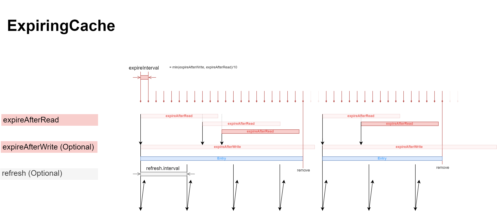

# SCache

[](https://github.com/evolution-gaming/scache/actions?query=workflow%3ACI)
[](https://coveralls.io/r/evolution-gaming/scache)
[](https://www.codacy.com/gh/evolution-gaming/scache/dashboard?utm_source=github.com&amp;utm_medium=referral&amp;utm_content=evolution-gaming/scache&amp;utm_campaign=Badge_Grade)
[](https://evolution.jfrog.io/artifactory/api/search/latestVersion?g=com.evolution&a=scache_2.13&repos=public)
[](https://opensource.org/licenses/MIT)

## Key features

* Available for: Scala 2.13.x and 3.3.x
* Autoloading of missing values
* Expiry of not used records
* Deleting the oldest values in case of exceeding max size
* Tagless Final
* Partition entries by `hashCode` into multiple caches in order to avoid thread contention for some
  corner cases

## Introduction

`Cache` is a main entry point towards `scache` library. Most users may want to call `Cache#expiring`
method to get the instance of the trait. The documentation could be found in source code of
[Cache.scala](src/main/scala/com/evolution/scache/Cache.scala) and also at
[javadoc.io](https://javadoc.io/doc/com.evolution/scache_2.13/latest/com/evolution/scache/Cache$.html).

See [Setup](https://github.com/evolution-gaming/scache#setup) for more details on how to add the
library itself.

## Cache.scala

```scala
trait Cache[F[_], K, V] {

  def get(key: K): F[Option[V]]

  def getOrElse(key: K, default: => F[V]): F[V]

  /**
   * Does not run `value` concurrently for the same key
   */
  def getOrUpdate(key: K)(value: => F[V]): F[V]

  /**
   * Does not run `value` concurrently for the same key
   * Releasable.release will be called upon key removal from the cache
   */
  def getOrUpdateReleasable(key: K)(value: => F[Releasable[F, V]]): F[V]

  /**
   * @return previous value if any, possibly not yet loaded
   */
  def put(key: K, value: V): F[F[Option[V]]]


  def put(key: K, value: V, release: F[Unit]): F[F[Option[V]]]


  def size: F[Int]


  def keys: F[Set[K]]

  /**
   * Might be an expensive call
   */
  def values: F[Map[K, F[V]]]

  /**
   * @return previous value if any, possibly not yet loaded
   */
  def remove(key: K): F[F[Option[V]]]


  /**
   * Removes loading values from the cache, however does not cancel them
   */
  def clear: F[F[Unit]]
}
```

## SerialMap.scala

```scala
trait SerialMap[F[_], K, V] {

  def get(key: K): F[Option[V]]

  def getOrElse(key: K, default: => F[V]): F[V]

  /**
   * Does not run `value` concurrently for the same key
   */
  def getOrUpdate(key: K, value: => F[V]): F[V]

  def put(key: K, value: V): F[Option[V]]

  /**
   * `f` will be run serially for the same key, entry will be removed in case of `f` returns `none`
   */
  def modify[A](key: K)(f: Option[V] => F[(Option[V], A)]): F[A]

  /**
   * `f` will be run serially for the same key, entry will be removed in case of `f` returns `none`
   */
  def update[A](key: K)(f: Option[V] => F[Option[V]]): F[Unit]

  def size: F[Int]

  def keys: F[Set[K]]

  /**
   * Might be an expensive call
   */
  def values: F[Map[K, V]]

  def remove(key: K): F[Option[V]]

  def clear: F[Unit]
}
```

## Setup

`scache`, along with its dependencies, is available on Evolution's JFrog Artifactory. That is why
one needs to include a dependency on https://github.com/evolution-gaming/sbt-artifactory-plugin.

```scala
addSbtPlugin("com.evolution" % "sbt-artifactory-plugin" % "0.0.2")

libraryDependencies += "com.evolution" %% "scache" % "<latest version from badge>"
```

## ExpiringCache



### Recommendations

* There is no use to make `refresh.interval` bigger than `expireAfterWrite`. It's just the waste of
  resources.
* Touch, despite its name, is not called after refresh.
* expireAfterWrite, despite its name, is calculated from date of creation, not time of update.

## Benchmarks

The `benchmark` module holds a JMH benchmark of the cache operations under contention. One
invocation is the whole workload, 8 fibers running 20000 operations each against a key space of
10000, so the reported number is cache operations per second with the contention included.

```scala
// everything, around 10 minutes
sbt "benchmark/Jmh/run"

// one scenario, one flavor
sbt "benchmark/Jmh/run -p flavor=partitioned .*getOrUpdateHitRandomKeys.*"

// longer run when the defaults are too noisy to tell two numbers apart
sbt "benchmark/Jmh/run -wi 5 -i 10 -r 5s"
```

`flavor` picks how the cache is put together: `single` is one unpartitioned `LoadingCache`,
`partitioned` is `Cache.loading`, `expiring` is `Cache.expiring` with the expiration set far enough
away not to interfere.

The whole suite is kept under ten minutes, which is one warmup and five measurement iterations per
scenario. That is enough to compare implementations or spot a regression, not to argue about a few
percent, and some of the scenarios below are visibly noisy.

### Results

Two runs back to back on the same machine, 12 cores, JDK 25, Scala 2.13.18: the cache as of commit
`7c9fa9f`, where the whole map sat in one `Ref[F, Map[K, EntryRef]]`, and the same cache after it
was rebuilt on `MapRef`. Millions of operations per second, before to after, higher is better.

| Scenario                                          |                 single |            partitioned |               expiring |
|---------------------------------------------------|-----------------------:|-----------------------:|-----------------------:|
| `getOrUpdate`, insert distinct keys               |   1.25 to 2.06 (1.65x) |   2.11 to 2.41 (1.14x) |   1.91 to 1.99 (1.04x) |
| `getOrUpdate`, hit random keys                    |  9.56 to 12.60 (1.32x) | 10.68 to 11.46 (1.07x) |   7.89 to 9.12 (1.16x) |
| `getOrUpdate`, hit single hot key                 | 10.65 to 13.82 (1.30x) | 12.14 to 12.58 (1.04x) |  9.38 to 10.40 (1.11x) |
| `get`, hit random keys                            | 21.74 to 26.10 (1.20x) | 21.37 to 23.02 (1.08x) | 12.68 to 13.22 (1.04x) |
| `get1`, hit random keys                           | 19.47 to 23.66 (1.21x) | 18.78 to 22.14 (1.18x) | 12.59 to 12.92 (1.03x) |
| `contains`, random keys                           | 26.69 to 31.97 (1.20x) | 23.59 to 33.70 (1.43x) | 23.22 to 33.68 (1.45x) |
| `put`, insert distinct keys                       |   1.66 to 9.24 (5.56x) |  5.40 to 10.30 (1.91x) |   5.47 to 8.86 (1.62x) |
| `put`, replace random keys                        |   8.13 to 9.53 (1.17x) |   7.37 to 8.83 (1.20x) |   7.88 to 8.00 (1.01x) |
| `modify`, insert distinct keys                    |  1.88 to 11.44 (6.09x) |  6.13 to 10.65 (1.74x) |  7.15 to 11.76 (1.65x) |
| `modify`, update random keys                      |  7.24 to 11.13 (1.54x) |   8.03 to 9.27 (1.15x) |  9.63 to 10.53 (1.09x) |
| `remove` and `put`, random keys                   |   0.84 to 3.87 (4.59x) |   2.45 to 4.05 (1.65x) |   2.42 to 2.97 (1.23x) |
| mixed `get`/`getOrUpdate`/`put`/`modify`/`remove` |   5.40 to 7.45 (1.38x) |   6.32 to 7.40 (1.17x) |   5.08 to 5.56 (1.09x) |

The gains are largest exactly where the old implementation had to CAS the shared map, i.e. inserting
and removing keys, and they shrink with partitioning, which is what partitioning was there to work
around in the first place. Reads gain less, and `foldMap`, the one operation that used to get an
atomic snapshot and now walks a `ConcurrentHashMap`, is a few percent slower: 1176 to 1146, 1142 to
1105 and 1009 to 996 traversals of 10000 entries per second.

Do not read too much into a single digit of these numbers. The suite is short by design, several
scenarios have error margins of tens of percent, and the two runs were taken on a shared machine.
The raw JMH output of both runs, error margins and all, is in `benchmark/results`.

### Comparing against another revision

The module builds against the `scache` sources next to it, so an older revision is measured by
putting the module on top of that revision and running it there. Both runs have to happen on the
same machine, one after the other, or the numbers are not comparable.

```shell
git worktree add /tmp/scache-old <revision>
cp -r benchmark /tmp/scache-old/
cp build.sbt /tmp/scache-old/build.sbt
cp project/plugins.sbt /tmp/scache-old/project/plugins.sbt

cd /tmp/scache-old && sbt "benchmark/Jmh/run -rf json -rff /tmp/old.json"
cd -                && sbt "benchmark/Jmh/run -rf json -rff /tmp/new.json"
```

The `benchmark` project and the JMH plugin come from `build.sbt` and `project/plugins.sbt`, which is
why those two are copied over as well. If the older revision has a different internal API, the
benchmark will not compile there until the affected lines are adjusted. Going back past the `MapRef`
rewrite, for instance, only the `single` flavor needs it:

```scala
case "single" => LoadingCache.of(LoadingCache.EntryRefs.empty[IO, Int, Int])
```

Finally, `git worktree remove /tmp/scache-old` when done.

## Migrating to 7.0

The cache state moved from a single `Ref[F, Map[K, EntryRef]]` to a per-key `MapRef` over a
`ConcurrentHashMap`. What that means for the users:

**Type classes.** `Cache.loading`, `Cache.expiring`, `SerialMap.of` and `SerialMap.apply` now ask
for `Async[F]` instead of `Concurrent[F]` / `Temporal[F]`, because the new state needs `Sync` for
the `ConcurrentHashMap` next to `Concurrent` for the fibers. Nothing to do for `IO` or for any stack
that already has an `Async` instance, otherwise the call sites have to provide one.

**Removed.** `LoadingCache.EntryRefs`, and with it the overload
`LoadingCache.of(map: EntryRefs[F, K, V])`. Both were `private[scache]`, so this only affects code
inside this library. `LoadingCache.of[F, K, V]` replaces them.

**No more contention failures.** `getOrUpdate` used to give up with
`IllegalStateException("extreme contention")` after 10000 lost CAS attempts on the shared state.
Operations on distinct keys no longer contend at all, so the limit is gone along with that failure
mode.

**Cancelling a load cleans up.** Cancelling `getOrUpdate` now removes the entry it installed and
fails everyone waiting for that entry with `CancelledError`, instead of leaving the key unusable and
its waiters blocked forever. Note that the load is shared, so this reaches callers that were not
cancelled themselves: if two requests ask for the same key, the first one runs the load and the
second one waits for it, then a timeout cancelling the first fails the second with `CancelledError`
as well. It gets to retry, where before it would have hung.

**Loads can expire.** `ExpiringCache` evicts entries that have been loading longer than
`Config.loadingTimeout`, failing their waiters with `ExpiredError`. The load itself is not
cancelled, only detached from the cache. `loadingTimeout` defaults to the smaller of
`expireAfterRead` and `expireAfterWrite`, so set it explicitly if the loads are legitimately slower
than the expiration.

**Enumeration is weakly consistent.** `keys`, `values`, `values1`, `size`, `foldMap` and
`foldMapPar` are served by the `ConcurrentHashMap` and no longer observe an atomic snapshot of the
map: an entry added or removed concurrently may or may not be included.

## Release process

The release process is based on Git tags and makes use
of [evolution-gaming/scala-github-actions](https://github.com/evolution-gaming/scala-github-actions)
which uses [sbt-dynver](https://github.com/sbt/sbt-dynver) to automatically obtain the version from
the latest Git tag. The flow is defined in `.github/workflows/release.yml`.  
A typical release process is as follows:

1. Create and push a new Git tag. The version should be in the format `vX.Y.Z` (example: `v4.1.0`).
   Example: `git tag v4.1.0 && git push origin v4.1.0`
2. On success, a new GitHub release is automatically created with a calculated diff and
   auto-generated release notes. You can see it on `Releases` page, change the description if needed
3. On failure, the tag is deleted from the remote repository. Please note that your local tag isn't
   deleted, so if the failure is recoverable then you can delete the local tag and try again (an
   example of *unrecoverable* failure is successfully publishing only a few of the artifacts to
   Artifactory which means a new attempt would fail since Artifactory doesn't allow overwriting its
   contents)
